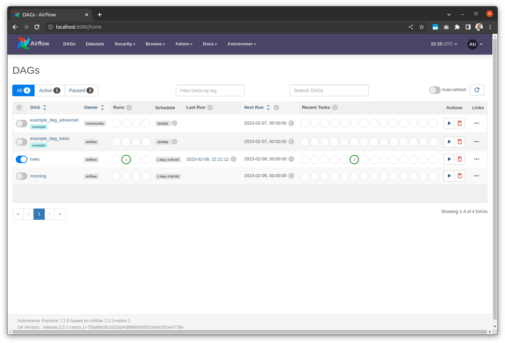
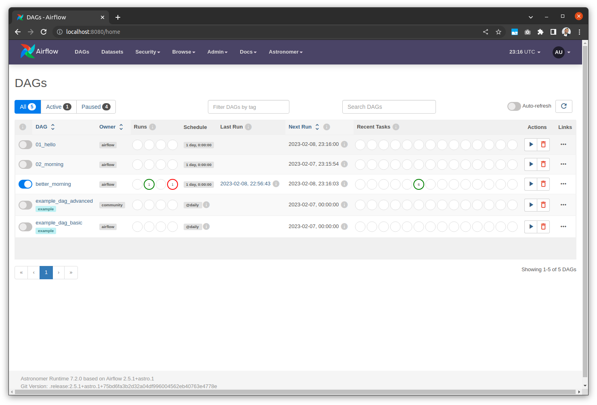
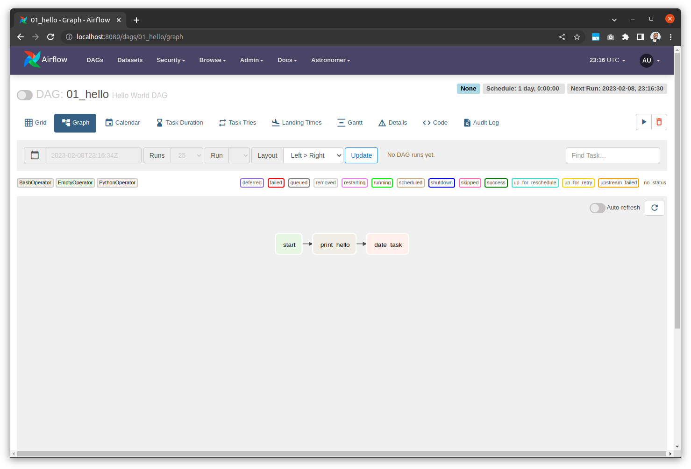
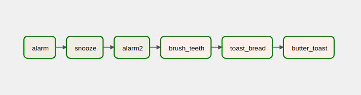

Apache Airflow Workshop - Part1
=================================

Apache Airflow is an open source tool for programmatically authoring, scheduling, and monitoring data pipelines. It has over 9 million downloads per month and an active OSS community. Airflow allows data practitioners to define their data pipelines as Python code in a highly extensible and infinitely scalable way.

<br>

In this workshop we will learn the basics of Apache Airflow by:

1. Running Airflow locally via [Astronomer CLI](https://docs.astronomer.io/astro/cli/overview)
2. Getting familiar with using **Airflow UI**
3. Understanding Airflow concepts such as **DAGs** and **Task Operators**
4. Authoring our own DAGs or _data pipelines_


## Prerequisites

This workshop requires the following components to be pre-installed on your machine:

- [Python](https://python.land/installing-python) (version 3.7 or higher)
- [VS Code](https://code.visualstudio.com/download) (or your IDE of choice!)
- [Docker](https://docs.docker.com/get-docker/)

**Docker** is required to run Airflow containers locally.


Clone the Project
=================

First, let's clone the project from our git repo. You can find our repo at: [https://github.com/datastackacademy/airflow-workshop](https://github.com/datastackacademy/airflow-workshop)

Open a command terminal and run:

```bash
git clone https://github.com/datastackacademy/airflow-workshop.git
```

Open the project in **VS Code**:

```bash
cd airflow-workshop
code .
```

To view these instructions in VS Code, open the [`README.md`](README.md) file press `CTRL` + `SHIFT` + `V`


Install Astro CLI
=================

We will install and run Airflow locally via the [Astronomer CLI](https://docs.astronomer.io/astro/cli/install-cli).

#### Mac OS

Open the Command terminal and run:

```bash
brew install astro
```

#### Linux and Windows WSL

Install the CLI by running the installer script in a bash terminal:

```bash
curl -sSL install.astronomer.io | sudo bash -s
```

#### Windows

Open a Windows PowerShell as an **administrator** and run:

```powershell
winget install -e --id Astronomer.Astro
```


Run Airflow
===========

Let's start Airflow and initialize with our pre-defined DAGs (_pipelines_) built in this workshop. 

We will use Astr CLI to initialize a local Airflow cluster on Docker. Please ensure that **Docker** is installed an running on your machine.

Start Airflow via Astro CLI

```bash
astro dev init
```

**NOTE:** You will get a warning regarding the folder not being empty. Press 'Y' to continue.

Let's review the project content created:

- `dags`: This folder contains the Python files for your Airflow DAGs (_pipelines_). This workshop seeds this folder with some pre-built DAGs.
- `Dockerfile`: This file contains a versioned Astro Runtime Docker image that provides a differentiated Airflow experience. 
- `include`: This folder contains any additional files or 3rd party libs that you want to include as part of your project.
- `packages.txt`: Install OS-level packages needed for your project by adding them to this file.
- `requirements.txt`: Install Python packages needed for your project by adding them to this file.
- `plugins`: Add custom or community plugins for your project to this file.
- `airflow_settings.yaml`: Use this local-only file to specify Airflow Connections, Variables, and Pools instead of entering them in the Airflow UI as you develop DAGs in this project.

Now, let's start Airflow:

```bash
astro dev start
```

This command starts a new Astronomer (Airflow) project and starts a series of docker containers running Airflow. 

**NOTE:** Please allow this command to run for a few minutes.

Let's review the Airflow architecture while this command finishes setting up Airflow:


- Postgres: Airflow's Metadata Database
- Webserver: The Airflow component responsible for rendering the Airflow UI
- Scheduler: The Airflow component responsible for monitoring and triggering tasks
- Triggerer: The Airflow component responsible for triggering deferred tasks

<br>

Open a browser and navigate to Airflow UI: [http://localhost:8080](http://localhost:8080/home)




Airflow UI
===========

Let's open the [Airflow UI](http://localhost:8080/home) and get familiar with it's interface.


Our Airflow DAG folder includes a number of pre-built example DAGs. Open the 'example_dag_basic' DAG:

1. Unpause the DAG by flipping the toggle button on the top left next to the DAG name
1. Run it!
3. Notice that you can hover over nodes in the graph/tree views and get more detailed task information
4. Look at the 'Log' out put for some nodes.
5. Once you have an overview of the DAG structure, click on the 'Code' tab to see the Python code for the DAG definition. We haven't talked about many of the details of DAG implementations yet, but you can still learn a lot by looking at the code. Familiarize yourself with the overall structure of the DAG definitions:
6. Run the DAG a few more times
7. Switch to the "Calendar" and "Gantt" view


Our first DAG
==============


There's a simple DAG called `01_hello.py` inside our `dags/` directory. This is the directory Airflow automatically checks for DAGs. Here are the contents of our script:


```python
from datetime import timedelta, datetime

# The DAG object; we'll need this to instantiate a DAG
from airflow import DAG

# Operators; we need this to operate!
from airflow.operators.empty import EmptyOperator
from airflow.operators.bash import BashOperator
from airflow.operators.python import PythonOperator


def print_date():
    """A very simple python function to call"""
    print(datetime.now())


# instantiate a DAG!
with DAG(
    dag_id='01_hello',                      # a unique name for our DAG
    description='Hello World DAG',          # a description of our DAG
    start_date=datetime.utcnow(),           # when to start running this DAG
    schedule_interval=timedelta(days=1),    # how often to run this DAG
    catchup=False,                          # do NOT catch up on previously skipped tasks
    is_paused_upon_creation=True,           # paused by default
) as dag:
    
    # create simple tasks:
    dummy_task = EmptyOperator(
        task_id='start'
    )

    hello_task = BashOperator(
        task_id='print_hello',
        bash_command='echo Hello World'
    )

    date_task = PythonOperator(
        task_id="date_task",
        python_callable=print_date
    )

    # set the task order
    dummy_task >> hello_task >> date_task

```
Once this file is in our `dags/` directory, it will appear in our DAGs list:



and if we click on our DAG, we can see the simple structure in the Graph view:



Let's take a closer look at what is in our `hello.py` to learn about how we define a DAG.


### DAG instantiation

With our configuration set, we can now instantiate a DAG. After importing the `DAG` object from `airflow`, the standard way to instantiate a `DAG` is a `with` statement: 
```python
# instantiate a DAG!
with DAG(
    dag_id='01_hello',                      # a unique name for our DAG
    description='Hello World DAG',          # a description of our DAG
    start_date=datetime.utcnow(),           # when to start running this DAG
    schedule_interval=timedelta(days=1),    # how often to run this DAG
    catchup=False,                          # do NOT catch up on previously skipped tasks
    is_paused_upon_creation=True,           # paused by default
) as dag:
```

As you can see, we set a DAG name with the first argument. This name needs to be unique across all DAGs your Airflow instance has access to. We can also provide a more verbose `description` and then pass in the default args. 

### scheduling

The two parameters we will use for scheduling are `start_date` and `scheduling_interval`.

- `start_date`
  - This parameter sets the time when Airflow will begin running the DAG. 
  - It is often a `datetime` but in this case, we're using the `airflow.utils.dates` function `days_ago`. This is because if the current time is past the `start_date`, airflow will attempt to run all the missing scheduled runs since that start date. By setting `start_date=days_ago(2)` the start date will always be two days before when the DAG is 
- `scheduling_interval`
  - After the `start_date` passes, Airflow waits for the `scheduling_interval` to pass and then triggers the DAG to run.
    - Note: this is why we can never use `datetime.now()` for the `start_date`. `datetime.now()` always returns the current time so we will never be a `scheduling_interval` past the current time.
  - `scheduling_interval` can be a:
    -`datetime.timedelta` as we used
    - `@` syntax for `@daily`, `@hourly`, etc
    - a [cron schedule expression](https://crontab.guru/) if you are familiar with those.
  - In our example, because `start_date` is two days ago and our `scheduling_interval=timedelta(days=1)`, when we toggle our DAG on in Airflow, we create 2 runs: at `start_date` Airflow looks forward 1 day for the `scheduling_interval`, triggers the DAG then looks forward one more day to the current time and triggers it a second time.


### operators

Inside the `with DAG:...` statement, we can define our tasks as airflow operators. We will start with the three simplifies operators:

- [EmptyOperator](https://airflow.apache.org/docs/apache-airflow/stable/_api/airflow/operators/empty/index.html)
  - To quote the documentation "Operator that does literally nothing". It can be helpful when figuring out DAG graph structure or in grouping tasks in a DAG.

- [BashOperator](https://airflow.apache.org/docs/apache-airflow/stable/howto/operator/bash.html)
  - `BashOperator` allows us to to run any bash command we want. 
  - The first argument of the operator is the `task_id`, a unique identifier for this task within the `DAG`.
  - The next argument is the command we want to run. For a simple command like `echo` we can provide a string with the entirety of the bash command we want to run.

```python
    hello_task = BashOperator(
        task_id='print_hello',
        bash_command='echo Hello World'
    )
```

- [PythonOperator](https://airflow.apache.org/docs/apache-airflow/stable/howto/operator/python.html)
  - The first argument is once again a unique `task_id`.
  - the `python_callable` allows our `DAG` to execute any python-callable we can supply.
  - For this example, we define a simple print function and provide it as our callable:
  ```python
    date_task = PythonOperator(
        task_id="date_task",
        python_callable=print_date
    )
  ```

### Task Dependencies

With two tasks defined, we now need to tell our `DAG` what order to execute them. If we don't do this step, all tasks will be run at the same time.

We often need them to run in a specific order. We do this by defining:

```python
    # set the task order
    dummy_task >> hello_task >> date_task
```


Exercise - Morning Routine DAG
==================================

In the `dags` folder, there's a partly-written DAG called `02_morning.py` that represents a morning routine: an alarm rings, it's snoozed, it rings again, teeth get brushed while the bread is toasting, and once the toast is ready it can get buttered, like so:




